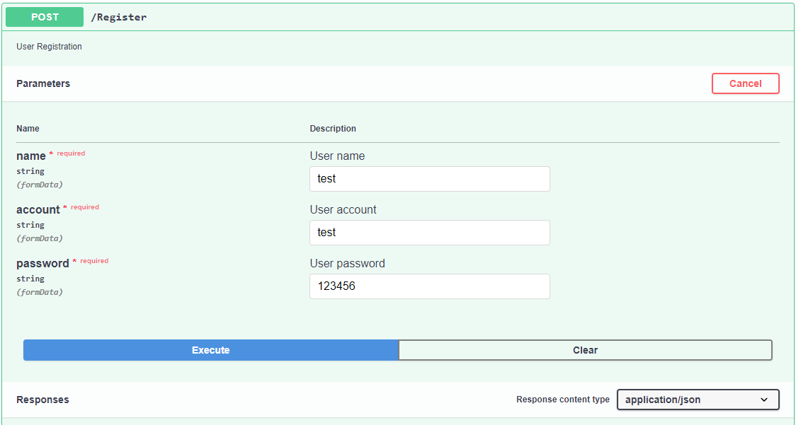
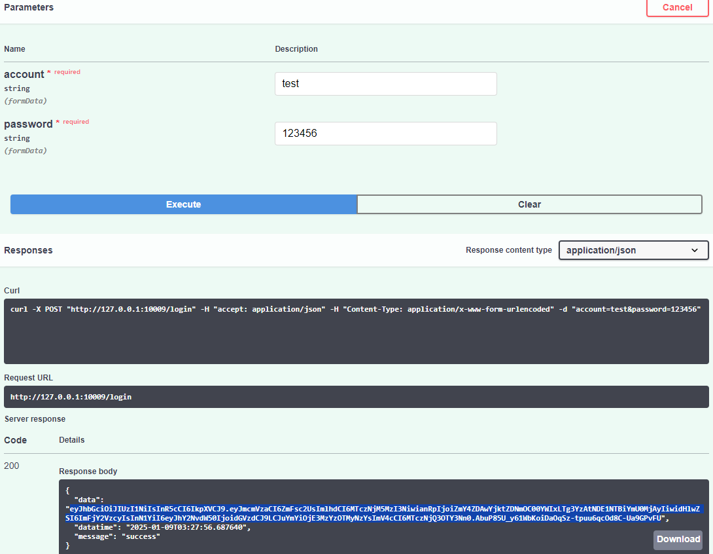
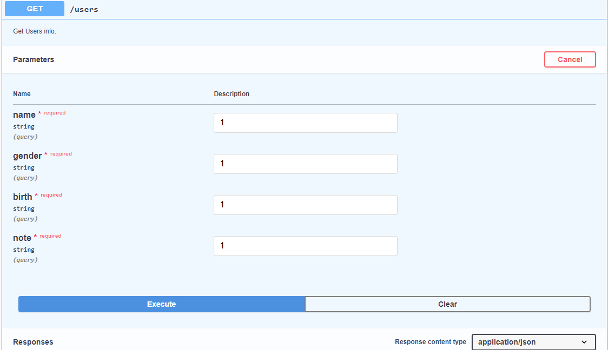
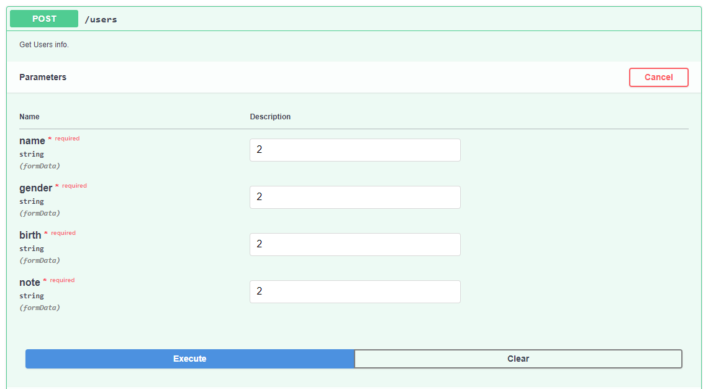
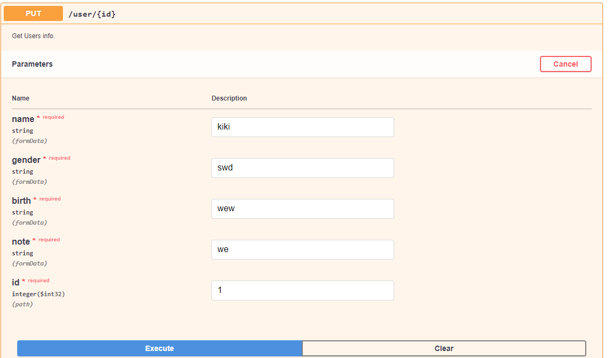
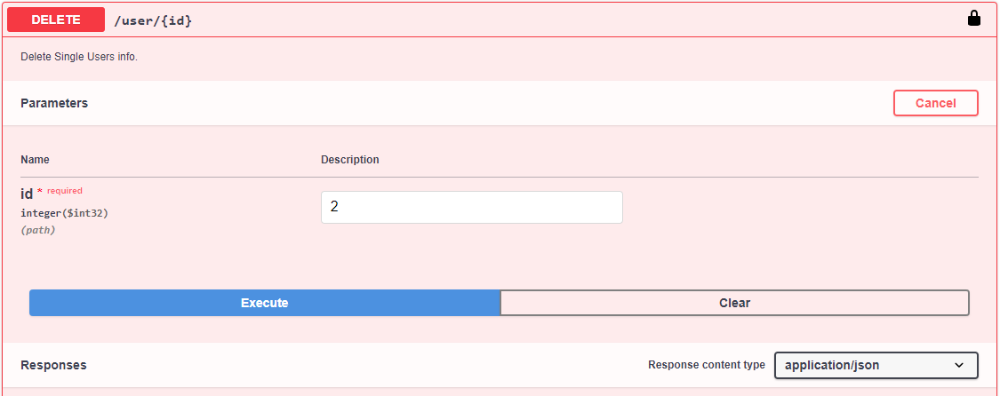
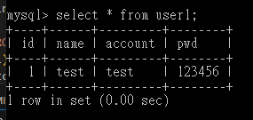
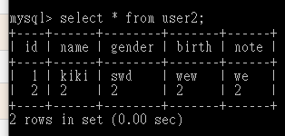
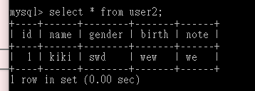

# DB_connect

用Flask架設API連接資料庫內容，以Swagger頁面呈現Get、Post、Put等功能。

# 程式碼

```bash=
# api設定
api.py


# 回應設定
util.py


# /resource
# 登入設定
login.py
login_route_model.py


# 使用者設定
user.py
user_route_model.py


# 資料庫連結
mydb.py
```

# 成果展示

## Swagger頁面

1. Register


2. Login


3. Get


4. Post


5. Put


6. Delete


## 資料庫畫面
1. 在Swagger註冊資料後，資料庫呈現


2. Get/Post 打入資料到資料庫


3. 在Swagger刪除資料後，資料庫呈現
